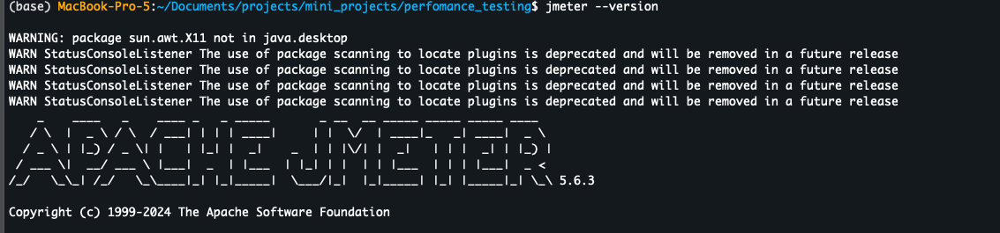
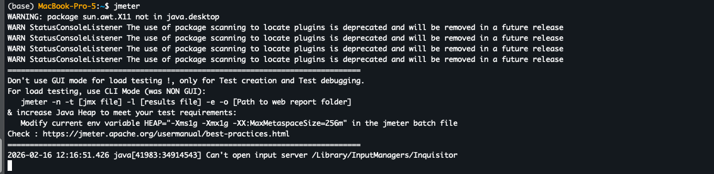
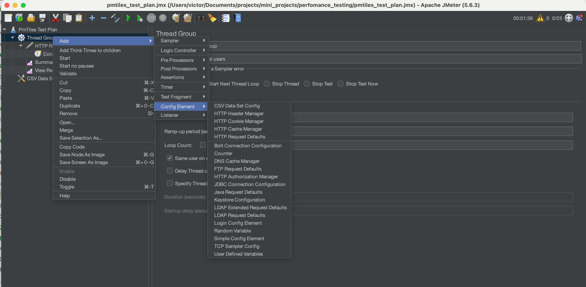
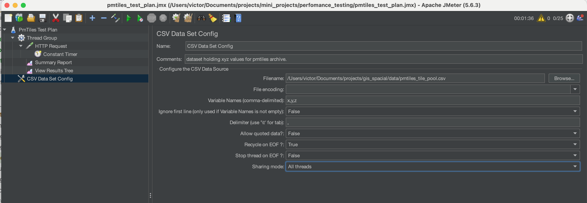
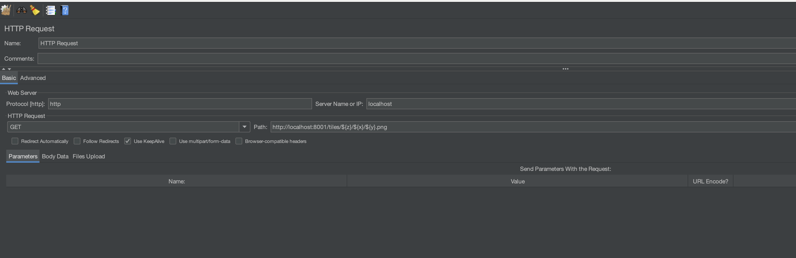

# Quality Assuarance - API Testing

- [Overview](#overview)
- [Perfomance Metrics](#perfomance-metrics)
- [Interpreting test results](#)
- [Testing Tools](#testing-tools)
- [Apache jmeter Setup on Mac](#apache-jmeter---setup-on-mac)
    - [Install Java JDK](#install-java-jdk)
    - [Install Jmeter](#install-jmeter)
- [Test run #1](#test-run-1)
- [ref](#ref)

## Overview
API tests span:
- **Functional** tests
    - ensure the api perfoms its intended functionalities properly(returns right data).
- **Perfomance** tests addressiing the important how:
    - How fast does it respond under a heavy load?
    - How reliably can it handle spikes in traffic?
    - How close is it to its breaking point?

    - involved in testing for responsiveness, speed, stability, and scalability, focusing on:
        - **Load testing** (simulating anticipated user/transaction traffic)
        - **Stress testing** (identifying the system’s breaking point)
        - **Scalability testing** (assessing performance under increasing load)


## Perfomance Metrics
1. **Response time**

The duration between sending a request and receiving an api response.

Low response time = a responsive + efficient api

High response time = backend bottlenecks + frustrated users 

2. **Error rate**

An indicator of how many requests failed out of the total.

High error rates could signify
- application logic faults
- server overload
- misconfigured endpoints
- network problems

3. **Latency**

this is the delay in network communication, excluding backend processing.

relevant for real-time apps like dynamic tilers, chat, video or gaming apis.

4. **CPU & memory usage**

during traffic surges these metrics inform us how our api utilizes system resources.

sudden spikes in cpu/memory use under moderate load may show potential code errors like
- memory leaks 
- wasteful db searches

    
## Interpreting test results

1. **Establish a baseline**

set thresholds for critical perfomance measures such as response time, error rates and throughput.

this helps determine whether the present perfomance is acceptabe, improved or worse than before.

2. **Evaluate response time trends**

avoid using the average response time as the first check
- low average may appear fit but may cover latency issues if certain requests take longer.

More reliable indicators of how the api perfoms for most users are percentile metrics(95th/99th percentiles)

To interpret response times, ask:
- are response times consistent between test scenarios?
- do they steadily increase with higher loads?
- is there a rise in specific request volume?

an `upward trend` during a stress test might `signify` our system is nearing its `breaking point` & demands `horizontal scaling/optimization`

3. **Understand error rate patterns**

a low error rate may be acceptable under high stress during load testing.

recurring failures under reqular traffic conditions should be investigated

be in the lookut for:
- error distribution patterns(e.g., all errors occcur after a given load level)
- specific endpoints return higher error rates
- is there a correlation between 
    - increased errors
    - reponse time or
    - resource spikes

high error rates could indicate:
- resource exhaustion, 
- misconfiguration or
- backend logic flows

4. **Correlate Metrics for deeper insights**

search for:
- Rising response times + low throughput: Is the server overloaded or is it a database bottleneck?
- High throughput + rising error rates: api may accept more traffic gracefully.
- Response time + error rate: is there a perfomance reduction when under load?
- Throughput + system resource usage: is the infrastructure efficient?
- latency + response time: is the network a bottleneck?


## Testing tools

1. Apache jmeter
2. Postman

|   Features/Criteria                       |                 Apache jmeter                                     |       Postman     
|:-----------------------------------------:|:-----------------------------------------------------------------:|:-----------------------------------------:
|   Primary functionality & purpose         |    load, perfomance & functional testing                            |     functional & integration testing
|   Primary user base                       |    perfomance engineers evaluating system behavior under load     |     developers, manual & automation QAs for api development, debugging & functional testing
|   supported protocols                     |   Broad: HTTP, HTTPS, Websocket, JMS, FTP, SOAP etc.              |     Limited to: HTTP, HTTPS & Websocket protocols
|   primary use case metrics                |   perfomance metrics: latency, response time, throughput & error rates under load    |     validating functional aspects: API contracts, schemas, JSON structure, status codes & headers
|   Team collaboration                      |   No built-in collaboration features. Can only share `.jmx` files(test plans)   |      Has workspaces for team collaboration. Collections can easily be shared as `.json` files
|   execution modes                         |   both GUI and CLI. CLI is recommended for actual perfomance testing      |       both GUI and CLI for CI/CD integration
|   Licensing & Cost                        |   open-source with an Apache 2.0 license(FREE)                            |       **Freemium model**: free version with core features; paid version adds advanced feature like mocking ulimited requests
|   Virtual user simulation                 |   spans to millions of virtually simulated users                          |       maxes out at 200 virtual users.


read more on the testing tools [here](#https://testsigma.com/blog/jmeter-vs-postman/)
## Apache jmeter - Setup on Mac 
### Install Java JDK:
Find an installer for your platform [here](https://www.oracle.com/java/technologies/downloads/#jdk25-mac).

1. **Check java-version**
```bash
java -version
```

2. **Get JDK path for setting the JAVA_HOME environment variable**
```bash
/usr/libexec/java_home
```
It will be something like
```zsh
/Library/Java/JavaVirtualMachines/jdk-25.jdk/Contents/Home
```

3. **Set the env variable**
```bash
vim ~/.bash_profile

##insert the env variable
export JAVA_HOME=/Library/Java/JavaVirtualMachines/jdk-25.jdk/Contents/Home
```

4. **Apply changes & check the path**
- expect the path added in step 3 above.
```zsh
source ~/.bash_profile

echo $JAVA_HOME
```

### Install Jmeter
```zsh
brew install jmeter
```

1. **Verify installation**
```zsh
jmeter --version
```


2. **launch jmeter**
```zsh
jmeter
```



### Load Testing
Load testing is a type of performance testing that measures how an application performs under heavy user activity and various conditions.

## Test run #1
**Scene**
- We will send 100 requests to STACAPI & record the response time. 
```zsh
Total requests = Num of Threads(users) x Loop Count
```
**Setting the test up**

1. **Add virtual users**

Add a `Thread group` (Virtual users with certain behaviour)

- User/Thread count: `25`
- Ramp-up period : `100 secs` - Total time(in seconds) it takes to add all test users
    - each user will start 4 seconds after the previous user begins
- Loop Count:  `4` - the number of times each user will make a request(Repeat)

For the rest of the steps, read more [here](https://medium.com/@simaalkan/jmeter-performance-testing-with-harry-potter-api-504365c5e60a)

**Adding dynamic url data**
- this data will be used to pass XYZ values for the tiles endpoint
- use [this file](https://github.com/mulyung1/gis_spacial/blob/main/find_zxy.py) (may require access) to generate the csv.

- add a csv dataset configuration


- set up variables


- in the request, add z, x, y as parameters.


**Run a Load test - CLI**

For heavy tests, it is recomended to use the non-GUI mode.
```zsh
jmeter -n -t test_plan.jmx -l results/results_$(date +%Y%m%d_%H%M%S).jtl -e -o results/dashboard_$(date +%Y%m%d_%H%M%S)

jmeter -n -t test_plan.jmx -l results/results_$(date +%Y%m%d_%H%M%S).jtl -e -o results/dashboard_$(date +%Y%m%d_%H%M%S)

```
- `n` : non‑GUI mode
- `t` : path to your test plan
- `l` : path to save raw results (JTL format)
- `e` : generate HTML dashboard after test
- `o` : output directory for dashboard (must be empty or non‑existent)


### ref
- https://www.cobeisfresh.com/blog/how-to-perform-load-testing-using-jmeter
- https://medium.com/@simaalkan/jmeter-performance-testing-with-harry-potter-api-504365c5e60a
- https://www.gravitee.io/blog/api-testing-performance-metrics-load-strategies
- https://testsigma.com/blog/jmeter-vs-postman/