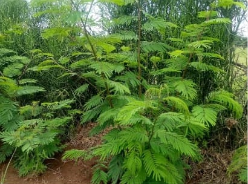
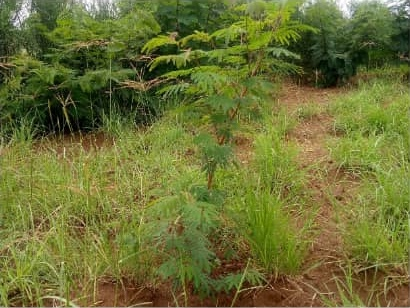
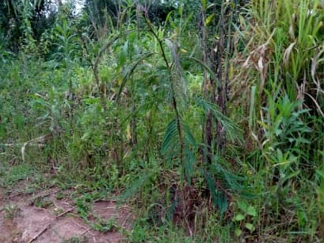
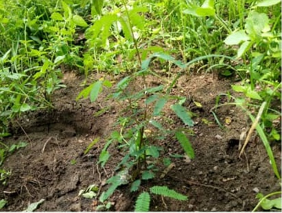

# problem

3 records, user says they did not upload. 
- failed upload for plot name `26b98006-7917-4a6e-90b0-e69baa120c34`
- success upload for `ace0a876-94ae-48d0-a7f7-c979a7008747`  - to check record completeness
- suceess upload for `de8a8d08-7f28-46f7-a8d4-6355fb43ad7f`  - to check record completeness

## plot 1: `26b98006-7917-4a6e-90b0-e69baa120c34` findings

```sql
regreen=> select * from respi_plots where name = '26b98006-7917-4a6e-90b0-e69baa120c34';
 id | recorded_dte | name | has_crops | fenced | estimated_size | calculated_size | estimated_size_unit_id | farming_entity_id | subcounty_id | other_ownership_type | fence_type | other_fence_type | crops | plot_ownership_type | conservation_area | livestock_allowed | photo_url
----+--------------+------+-----------+--------+----------------+-----------------+------------------------+-------------------+--------------+----------------------+------------+------------------+-------+---------------------+-------------------+-------------------+-----------
(0 rows)
```
### photo list
- JPEG_26e279d5-a21a-401f-9c7c-1bce852b7ed4_1011142051362997196.jpg 

by Kalisa James _Calliandra calothyrsus



- JPEG_35332941-374e-4051-8cd1-ad23d7f5ac66_1321209532571432244.jpg

by Kalisa James _Leucaena diversifolia



### judgement

- record never got to the db
- photos are not in db

## plot 2: `ace0a876-94ae-48d0-a7f7-c979a7008747` findings

### conflicting entries
|   entry       |   db side                  |   record side                |
|:-------------:|:--------------------------:|:----------------------------:|
| county name   | 55: `Eastern Province`     |  368: `Iburasirazuba`        | 
| 


### record completeness check

```sql
select 
    plt.*, scty.*, cty.*, ctry.*,  prj.*, farmer.*, ent.*, ch.*, tpmgt.*, trus.*, tparea.*, tpmst.*
	--plps.*
	
	-- scty.subcounty_name, scty.county_id, 
	-- farmer.first_name, farmer.last_name, farmer.organization, 
	-- ent.collector_id, usr.first_name, usr.username, ent.project_id, prj.project_name, 
	-- ch.scientific_name, ch.local_name, ch.date_planted, ch.trees_planted, ch.trees_survived

from 
    respi_plots plt 
inner join respi_subcounties scty on scty.id=plt.subcounty_id 
inner join respi_counties cty on cty.id=scty.county_id
inner join respi_countries ctry on ctry.id=cty.country_id
inner join respi_tree_planting_entry ent on ent.plot_id=plt.id 
inner join respi_regreeningusers usr on usr.id=ent.collector_id
inner join respi_farming_entity farmer on farmer.id=plt.farming_entity_id 
inner join respi_projects prj on prj.id=ent.project_id
inner join respi_cohort ch on ch.tp_entry_id=ent.id
inner join respi_tp_management_practices tpmgt on tpmgt.cohort_id = ch.id
inner join respi_tp_tree_usage trus on trus.cohort_id = ch.id
inner join respi_tp_plantingarea_type tparea on tparea.cohort_id = ch.id
inner join respi_tree_measurement tpmst on tpmst.cohort_id = ch.id

--inner join respi_plot_points plps on plps.plot_id=plt.id
where name='ace0a876-94ae-48d0-a7f7-c979a7008747';
```

### photo check
this plot has one photo 
- JPEG_9740f45d-c2c9-4eec-8021-d0f69a2c4e6a_1797884183254791545.jpg

by Cyabukombe Albert _Calliandra calothyrsus



```sql
regreen=> select * from respi_photo where photoname = 'JPEG_9740f45d-c2c9-4eec-8021-d0f69a2c4e6a_1797884183254791545.jpg';
 id | uploaded_at | file | photoname
----+-------------+------+-----------
(0 rows)
```

#### judgment
- record complete
- photo never got to db

##  plot 3: `de8a8d08-7f28-46f7-a8d4-6355fb43ad7f` findings

### record completeness check
```sql
select 
    plt.*, scty.*, cty.*, ctry.*,  prj.*, farmer.*, ent.*, ch.*, tpmgt.*, trus.*, tparea.*, tpmst.*
	--plps.*
	
	-- scty.subcounty_name, scty.county_id, 
	-- farmer.first_name, farmer.last_name, farmer.organization, 
	-- ent.collector_id, usr.first_name, usr.username, ent.project_id, prj.project_name, 
	-- ch.scientific_name, ch.local_name, ch.date_planted, ch.trees_planted, ch.trees_survived

from 
    respi_plots plt 
inner join respi_subcounties scty on scty.id=plt.subcounty_id 
inner join respi_counties cty on cty.id=scty.county_id
inner join respi_countries ctry on ctry.id=cty.country_id
inner join respi_tree_planting_entry ent on ent.plot_id=plt.id 
inner join respi_regreeningusers usr on usr.id=ent.collector_id
inner join respi_farming_entity farmer on farmer.id=plt.farming_entity_id 
inner join respi_projects prj on prj.id=ent.project_id
inner join respi_cohort ch on ch.tp_entry_id=ent.id
inner join respi_tp_management_practices tpmgt on tpmgt.cohort_id = ch.id
inner join respi_tp_tree_usage trus on trus.cohort_id = ch.id
inner join respi_tp_plantingarea_type tparea on tparea.cohort_id = ch.id
inner join respi_tree_measurement tpmst on tpmst.cohort_id = ch.id

--inner join respi_plot_points plps on plps.plot_id=plt.id
where name='de8a8d08-7f28-46f7-a8d4-6355fb43ad7f';
```

### photo check

the plot has two photos

1. JPEG_f701237b-7813-415d-8cbc-d954c78e9812_8621925078732629520.jpg
	- by Kagore Jane_Calliandra calothyrsus
	- has multiple entries links to the multiple occurring photo files.
		- https://radrs.icraf.org/uploaded/media/JPEG_f701237b-7813-415d-8cbc-d954c78e9812_8621925078732629520.jpg
		- https://radrs.icraf.org/uploaded/media/JPEG_f701237b-7813-415d-8cbc-d954c78e9812_8621925078732629520_jLv7vGI.jpg
		- https://radrs.icraf.org/uploaded/media/JPEG_f701237b-7813-415d-8cbc-d954c78e9812_8621925078732629520_BqQGvVs.jpg
		- https://radrs.icraf.org/uploaded/media/JPEG_f701237b-7813-415d-8cbc-d954c78e9812_8621925078732629520_CEqiws3.jpg
		- https://radrs.icraf.org/uploaded/media/JPEG_f701237b-7813-415d-8cbc-d954c78e9812_8621925078732629520_5eqxh1C.jpg
		- https://radrs.icraf.org/uploaded/media/JPEG_f701237b-7813-415d-8cbc-d954c78e9812_8621925078732629520_QJJcdTN.jpg
		- https://radrs.icraf.org/uploaded/media/JPEG_f701237b-7813-415d-8cbc-d954c78e9812_8621925078732629520_rznBTwl.jpg
		- https://radrs.icraf.org/uploaded/media/JPEG_f701237b-7813-415d-8cbc-d954c78e9812_8621925078732629520_qU3PRDX.jpg
		- https://radrs.icraf.org/uploaded/media/JPEG_f701237b-7813-415d-8cbc-d954c78e9812_8621925078732629520_Brx9lEd.jpg
		- https://radrs.icraf.org/uploaded/media/JPEG_f701237b-7813-415d-8cbc-d954c78e9812_8621925078732629520_O78wnyf.jpg
		- https://radrs.icraf.org/uploaded/media/JPEG_f701237b-7813-415d-8cbc-d954c78e9812_8621925078732629520_dIamC4k.jpg
		- https://radrs.icraf.org/uploaded/media/JPEG_f701237b-7813-415d-8cbc-d954c78e9812_8621925078732629520_liBqSby.jpg

```sql
regreen=> select * from respi_photo where photoname in ('JPEG_f701237b-7813-415d-8cbc-d954c78e9812_8621925078732629520.jpg');
  id   |          uploaded_at          |                                   file                                    |                             photoname
-------+-------------------------------+---------------------------------------------------------------------------+-------------------------------------------------------------------
 40752 | 2026-02-15 15:12:26.725376+03 | JPEG_f701237b-7813-415d-8cbc-d954c78e9812_8621925078732629520.jpg         | JPEG_f701237b-7813-415d-8cbc-d954c78e9812_8621925078732629520.jpg
 40753 | 2026-02-15 15:13:12.032998+03 | JPEG_f701237b-7813-415d-8cbc-d954c78e9812_8621925078732629520_jLv7vGI.jpg | JPEG_f701237b-7813-415d-8cbc-d954c78e9812_8621925078732629520.jpg
 40754 | 2026-02-15 16:13:03.630065+03 | JPEG_f701237b-7813-415d-8cbc-d954c78e9812_8621925078732629520_BqQGvVs.jpg | JPEG_f701237b-7813-415d-8cbc-d954c78e9812_8621925078732629520.jpg
 40755 | 2026-02-15 16:13:32.270504+03 | JPEG_f701237b-7813-415d-8cbc-d954c78e9812_8621925078732629520_CEqiws3.jpg | JPEG_f701237b-7813-415d-8cbc-d954c78e9812_8621925078732629520.jpg
 40756 | 2026-02-15 16:14:01.477886+03 | JPEG_f701237b-7813-415d-8cbc-d954c78e9812_8621925078732629520_5eqxh1C.jpg | JPEG_f701237b-7813-415d-8cbc-d954c78e9812_8621925078732629520.jpg
 40757 | 2026-02-15 16:14:19.703074+03 | JPEG_f701237b-7813-415d-8cbc-d954c78e9812_8621925078732629520_QJJcdTN.jpg | JPEG_f701237b-7813-415d-8cbc-d954c78e9812_8621925078732629520.jpg
 40758 | 2026-02-15 16:14:52.757287+03 | JPEG_f701237b-7813-415d-8cbc-d954c78e9812_8621925078732629520_rznBTwl.jpg | JPEG_f701237b-7813-415d-8cbc-d954c78e9812_8621925078732629520.jpg
 40759 | 2026-02-15 18:10:26.02193+03  | JPEG_f701237b-7813-415d-8cbc-d954c78e9812_8621925078732629520_qU3PRDX.jpg | JPEG_f701237b-7813-415d-8cbc-d954c78e9812_8621925078732629520.jpg
 40761 | 2026-02-16 11:02:08.416998+03 | JPEG_f701237b-7813-415d-8cbc-d954c78e9812_8621925078732629520_Brx9lEd.jpg | JPEG_f701237b-7813-415d-8cbc-d954c78e9812_8621925078732629520.jpg
 40762 | 2026-02-16 11:02:33.175391+03 | JPEG_f701237b-7813-415d-8cbc-d954c78e9812_8621925078732629520_O78wnyf.jpg | JPEG_f701237b-7813-415d-8cbc-d954c78e9812_8621925078732629520.jpg
 40763 | 2026-02-16 11:02:57.9566+03   | JPEG_f701237b-7813-415d-8cbc-d954c78e9812_8621925078732629520_dIamC4k.jpg | JPEG_f701237b-7813-415d-8cbc-d954c78e9812_8621925078732629520.jpg
 40764 | 2026-02-16 11:03:38.773291+03 | JPEG_f701237b-7813-415d-8cbc-d954c78e9812_8621925078732629520_liBqSby.jpg | JPEG_f701237b-7813-415d-8cbc-d954c78e9812_8621925078732629520.jpg
(12 rows)

regreen=> select * from respi_photo where photoname in ('JPEG_929717d5-4aa3-48e1-aa2a-77d4d2f2c196_6589291353806567431.jpg');
 id | uploaded_at | file | photoname
----+-------------+------+-----------
(0 rows)

```


2. JPEG_929717d5-4aa3-48e1-aa2a-77d4d2f2c196_6589291353806567431.jpg

by Kagore Jane _ leucaena diversifolia



- this photo never got uploaded

#### judgment
- record comlete
- photo 1 was uploaded 12 times
- photo 2 never got uploaded 


# solution
- api post request for plot `26b98006-7917-4a6e-90b0-e69baa120c34`
	- done
- photo upload for 
	- JPEG_26e279d5-a21a-401f-9c7c-1bce852b7ed4_1011142051362997196.jpg
	- JPEG_35332941-374e-4051-8cd1-ad23d7f5ac66_1321209532571432244.jpg
	- JPEG_9740f45d-c2c9-4eec-8021-d0f69a2c4e6a_1797884183254791545.jpg
	- JPEG_929717d5-4aa3-48e1-aa2a-77d4d2f2c196_6589291353806567431.jpg


