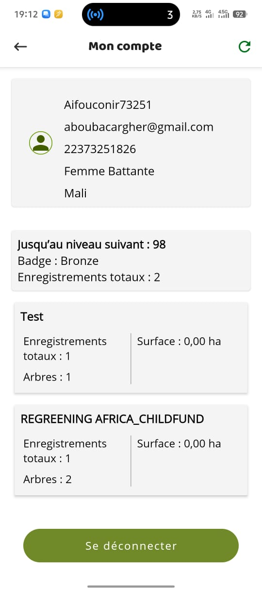
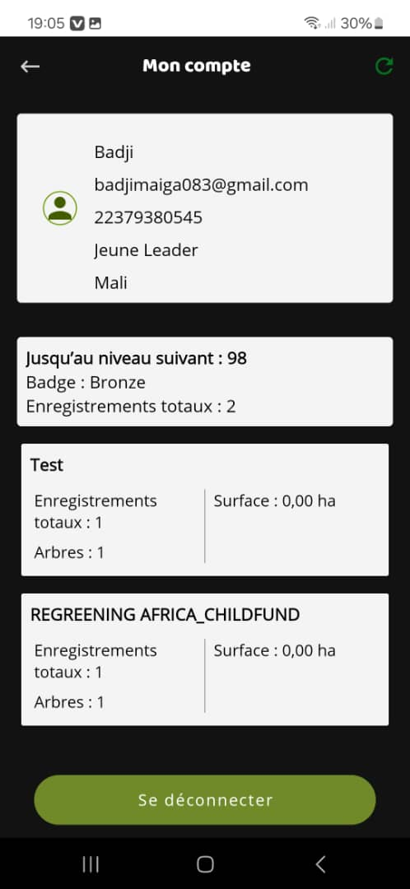

## problem

each user has collected 1 record in regreening_africa_child_fund project and they intend it to be in test project.

users are;
- aboubacargher@gmail.com


- badjimaiga083@gmail.com


## findings
#### aboubacargher@gmail.com - a tree planting entry

```sql
regreen=> select ent.id as tp_id, ent.recorded_dte as tp_recorded_date, ent.collector_id, ent.plot_id, ent.project_id, usr.first_name, usr.email, prj.project_name, ch.recorded_dte as tp_recorded_dte,ch.id as cohort_id, ch.scientific_name, ch.local_name from respi_tree_planting_entry ent inner join respi_regreeningusers usr on usr.id=ent.collector_id inner join respi_projects prj on prj.id=ent.project_id inner join respi_cohort ch on ch.tp_entry_id=ent.id where usr.email = 'aboubacargher@gmail.com' order by ent.recorded_dte desc;
 tp_id |       tp_recorded_date        | collector_id | plot_id | project_id | first_name |          email          |        project_name         |        tp_recorded_dte        | cohort_id |   scientific_name    | local_name 
-------+-------------------------------+--------------+---------+------------+------------+-------------------------+-----------------------------+-------------------------------+-----------+----------------------+------------
 10477 | 2025-10-04 20:05:29.862748+03 |         4513 |   18013 |         44 | Hamsatou   | aboubacargher@gmail.com | REGREENING AFRICA_CHILDFUND | 2025-10-04 20:05:29.869472+03 |     32502 | Abutilon mauritianum | citron
 10477 | 2025-10-04 20:05:29.862748+03 |         4513 |   18013 |         44 | Hamsatou   | aboubacargher@gmail.com | REGREENING AFRICA_CHILDFUND | 2025-10-04 20:05:29.890067+03 |     32503 |                      | citron
(2 rows)


```

#### badjimaiga083@gmail.com - a fmnr entry

```sql
regreen=> select ent.id as fmnr_id,ent.recorded_dte as fmnr_recorded_date, ent.collector_id, ent.plot_id, ent.project_id, usr.first_name,usr.email, prj.project_name, spc.recorded_dte as species_recorded_date,spc.id as species_id, spc.local_name, spc.scientific_name from respi_fmnr_entry ent inner join respi_regreeningusers usr on usr.id=ent.collector_id inner join respi_projects prj on prj.id=ent.project_id inner join respi_fmnr_species spc on spc.fmnr_entry_id=ent.id where usr.email = 'badjimaiga083@gmail.com' order by ent.recorded_dte desc;
 fmnr_id |      fmnr_recorded_date       | collector_id | plot_id | project_id | first_name |          email          |        project_name         |     species_recorded_date     | species_id | local_name | scientific_name 
---------+-------------------------------+--------------+---------+------------+------------+-------------------------+-----------------------------+-------------------------------+------------+------------+-----------------
    3510 | 2025-10-06 22:04:08.267384+03 |         4399 |   18103 |          6 | Badji      | badjimaiga083@gmail.com | Test                        | 2025-10-06 22:04:08.340062+03 |       9163 | chi        | 
    3467 | 2025-10-04 19:37:37.223111+03 |         4399 |   18011 |         44 | Badji      | badjimaiga083@gmail.com | REGREENING AFRICA_CHILDFUND | 2025-10-04 19:37:37.235648+03 |       9119 |            | Acacia arenaria
(2 rows)

```

## proposed solution
update project ids for both users to 6

```sql
update respi_tree_planting_entry set project_id = 6 where id = 10477;
update respi_fmnr_entry set project_id = 6 where id = 3467;
```

