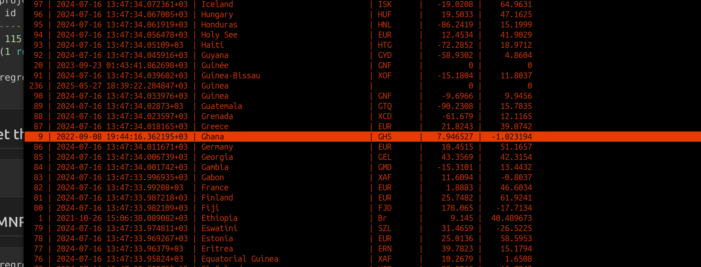

# Collectors First & lastname for Nbs_Guinean_Forests in Ghana

## get the project id
```sql
regreen=> select id, project_name from respi_projects where project_name='NbS_Guinean_Forests';
 id  |    project_name     
-----+---------------------
 115 | NbS_Guinean_Forests
(1 row)

regreen=> 
```

## inspect the tables refering to the project
```sql
regreen=> \d respi_projects
                                           Table "public.respi_projects"
       Column        |           Type           | Collation | Nullable |                  Default                   
---------------------+--------------------------+-----------+----------+--------------------------------------------
 id                  | integer                  |           | not null | nextval('respi_projects_id_seq'::regclass)
 recorded_dte        | timestamp with time zone |           | not null | 
 project_name        | character varying(50)    |           | not null | 
 project_description | character varying(500)   |           | not null | 
 project_logo_url    | character varying(2000)  |           |          | 
 country_id          | integer                  |           |          | 
 country_name        | character varying(100)   |           | not null | 
 created_by_id       | integer                  |           | not null | 
 organization_id     | integer                  |           | not null | 
 project_website_url | character varying(500)   |           |          | 
 qr_code_name        | character varying(500)   |           | not null | 
Indexes:
    "respi_projects_pkey" PRIMARY KEY, btree (id)
    "respi_projects_project_name_7f1c659d_uniq" UNIQUE CONSTRAINT, btree (project_name)
    "respi_projects_country_id_9d1d970d" btree (country_id)
    "respi_projects_created_by_id_885b77fe" btree (created_by_id)
    "respi_projects_organization_id_1bdf215f" btree (organization_id)
    "respi_projects_project_name_7f1c659d_like" btree (project_name varchar_pattern_ops)
Foreign-key constraints:
    "respi_projects_country_id_9d1d970d_fk_respi_countries_id" FOREIGN KEY (country_id) REFERENCES respi_countries(id) DEFERRABLE INITIALLY DEFERRED
    "respi_projects_created_by_id_885b77fe_fk_respi_reg" FOREIGN KEY (created_by_id) REFERENCES respi_regreeningusers(id) DEFERRABLE INITIALLY DEFERRED
    "respi_projects_organization_id_1bdf215f_fk_respi_org" FOREIGN KEY (organization_id) REFERENCES respi_organization(id) DEFERRABLE INITIALLY DEFERRED
Referenced by:
    TABLE "permissions_permissions" CONSTRAINT "permissions_permissi_project_id_5e55859d_fk_respi_pro" FOREIGN KEY (project_id) REFERENCES respi_projects(id) DEFERRABLE INITIALLY DEFERRED
    TABLE "respi_engagement" CONSTRAINT "respi_engagement_project_id_b231eeea_fk_respi_projects_id" FOREIGN KEY (project_id) REFERENCES respi_projects(id) DEFERRABLE INITIALLY DEFERRED
    TABLE "respi_fmnr_entry" CONSTRAINT "respi_fmnr_entry_project_id_b2749240_fk_respi_projects_id" FOREIGN KEY (project_id) REFERENCES respi_projects(id) DEFERRABLE INITIALLY DEFERRED
    TABLE "respi_nurserie" CONSTRAINT "respi_nurserie_project_id_7e17d077_fk_respi_projects_id" FOREIGN KEY (project_id) REFERENCES respi_projects(id) DEFERRABLE INITIALLY DEFERRED
    TABLE "respi_projectcountry" CONSTRAINT "respi_projectcountry_project_id_8141eb5b_fk_respi_projects_id" FOREIGN KEY (project_id) REFERENCES respi_projects(id) DEFERRABLE INITIALLY DEFERRED
    TABLE "respi_rangeland_entry" CONSTRAINT "respi_rangeland_entry_project_id_7e98905e_fk_respi_projects_id" FOREIGN KEY (project_id) REFERENCES respi_projects(id) DEFERRABLE INITIALLY DEFERRED
    TABLE "respi_trainings" CONSTRAINT "respi_trainings_project_id_2306fe18_fk_respi_projects_id" FOREIGN KEY (project_id) REFERENCES respi_projects(id) DEFERRABLE INITIALLY DEFERRED
    TABLE "respi_tree_planting_entry" CONSTRAINT "respi_tree_planting__project_id_428b0b45_fk_respi_pro" FOREIGN KEY (project_id) REFERENCES respi_projects(id) DEFERRABLE INITIALLY DEFERRED

```
we will check for data in the tables
- respi_engagement
- respi_fmnr_entry
- respi_nurserie
- respi_rangeland_entry
- respi_trainings
- respi_tree_planting_entry

## get the country id for Ghana (no duplicates)


```sql
regreen=> select * from respi_countries order by country_name desc;
```
## a. Engagement data collectors
```sql
regreen=> select distinct yuza.first_name, yuza.last_name, egm.collector_id, egm.project_id, prjc.country_id, ctr.country_name from respi_engagement egm join respi_regreeningusers yuza on yuza.id=egm.collector_id join respi_projectcountry prjc on prjc.project_id=egm.project_id join respi_countries ctr on ctr.id=prjc.country_id where egm.project_id =115 and ctr.id=9;
     first_name     | last_name | collector_id | project_id | country_id | country_name 
--------------------+-----------+--------------+------------+------------+--------------
 DORCAS             | AGYEI     |         3260 |        115 |          9 | Ghana
 Jean Kessel Django | Gnamiensa |         3255 |        115 |          9 | Ghana
(2 rows)

regreen=> 
```

## b. FMNR data collectors

```sql
regreen=> select distinct yuza.first_name, yuza.last_name, fmnr.collector_id, fmnr.project_id, prjc.country_id, ctr.country_name from respi_fmnr_entry fmnr join respi_regreeningusers yuza on yuza.id=fmnr.collector_id join respi_projectcountry prjc on prjc.project_id=fmnr.project_id join respi_countries ctr on ctr.id=prjc.country_id where fmnr.project_id =115 and ctr.id=9;
   first_name   |  last_name   | collector_id | project_id | country_id | country_name 
----------------+--------------+--------------+------------+------------+--------------
 Anthony        | Mba          |         3259 |        115 |          9 | Ghana
 Sandra         | Owusu        |         3698 |        115 |          9 | Ghana
 Ibrahima fanta | Conde        |         3803 |        115 |          9 | Ghana
 Jochebed       | Frimpong     |         3693 |        115 |          9 | Ghana
 John           | Ntori        |         3703 |        115 |          9 | Ghana
 Benjamin       | Afful        |         3691 |        115 |          9 | Ghana
 Florence       | Appah        |         3696 |        115 |          9 | Ghana
 Mamadou Aliou  | DIALLO       |         3811 |        115 |          9 | Ghana
 Jean Paul      | Fangamou     |         3801 |        115 |          9 | Ghana
 Emmanuel       | Amoako       |         3740 |        115 |          9 | Ghana
 Cisse          | Tounkara     |         3812 |        115 |          9 | Ghana
 John Onwona    | Ayisi Jnr    |         3707 |        115 |          9 | Ghana
 Soriba         | Camara       |         3270 |        115 |          9 | Ghana
 Garrett        | Gyamfuaa     |         3695 |        115 |          9 | Ghana
 Wirekoh Junior | Joseph       |         3685 |        115 |          9 | Ghana
 Harriya        | Musah Yussif |         3699 |        115 |          9 | Ghana
 Kwasi Aning    | Dwumah       |         3692 |        115 |          9 | Ghana
 Aisha Kenin    | Bagulo       |         3702 |        115 |          9 | Ghana
 Michael        | Ochem        |         3257 |        115 |          9 | Ghana
 Mohamed Fanta  | TOUNKARA     |         3268 |        115 |          9 | Ghana
 Benjamin       | Afful        |         3760 |        115 |          9 | Ghana
 James          | Blay         |         3711 |        115 |          9 | Ghana
 Patricia       | Yeboah       |         3701 |        115 |          9 | Ghana
(23 rows)

```


## c. Nurserie data collectors 
```sql
regreen=> select distinct yuza.first_name, yuza.last_name, nrse.collector_id, nrs.project_id, prjc.country_id, ctr.country_name from respi_nurserie nrs join respi_nursery_entry nrse on nrse.nursery_id=nrs.id join respi_regreeningusers yuza on yuza.id=nrse.collector_id join respi_projectcountry prjc on prjc.project_id=nrs.project_id join respi_countries ctr on ctr.id=prjc.country_id where nrs.project_id =115 and ctr.id=9;
   first_name   | last_name | collector_id | project_id | country_id | country_name 
----------------+-----------+--------------+------------+------------+--------------
 Benjamin       | Afful     |         3760 |        115 |          9 | Ghana
 Emmanuel       | Amoako    |         3740 |        115 |          9 | Ghana
 Garrett        | Gyamfuaa  |         3695 |        115 |          9 | Ghana
 Ibrahima fanta | Conde     |         3803 |        115 |          9 | Ghana
 Jean Paul      | Fangamou  |         3801 |        115 |          9 | Ghana
 Kwasi Aning    | Dwumah    |         3692 |        115 |          9 | Ghana
 Lancei         | Kourouma  |         3806 |        115 |          9 | Ghana
 Mamadou Aliou  | DIALLO    |         3811 |        115 |          9 | Ghana
 Maurice        | Toure     |         3798 |        115 |          9 | Ghana
 Mohamed Fanta  | TOUNKARA  |         3268 |        115 |          9 | Ghana
 Patricia       | Yeboah    |         3701 |        115 |          9 | Ghana
 Soriba         | Camara    |         3270 |        115 |          9 | Ghana
(12 rows)

regreen=> 
```

## d. Rangeland data collectors - none
why? no rangeland data for project 115.
```sql
regreen=> select * from respi_rangeland_entry where project_id =115;
 id | recorded_dte | date_collected | collector_id | plot_id | project_id | is_revisit 
----+--------------+----------------+--------------+---------+------------+------------
(0 rows)

regreen=> 
```

## e. Trainings data collectors - none

```sql
regreen=> select * from respi_trainings where project_id =115;

 id | recorded_dte | date_collected | training_date | topic | type | venue | participants | female_participants | male_participants | youth_participants | partners | comment | collector_id | project_id | subcounty_id 
----+--------------+----------------+---------------+-------+------+-------+--------------+---------------------+-------------------+--------------------+----------+---------+--------------+------------+--------------
(0 rows)

```

## f. Tree planting data collectors
```sql
regreen=> select distinct yuza.first_name, yuza.last_name, tp.collector_id, tp.project_id, prjc.country_id, ctr.country_name from respi_tree_planting_entry tp join respi_regreeningusers yuza on yuza.id=tp.collector_id join respi_projectcountry prjc on prjc.project_id=tp.project_id join respi_countries ctr on ctr.id=prjc.country_id where tp.project_id =115 and ctr.id=9;
      first_name       |    last_name    | collector_id | project_id | country_id | country_name 
-----------------------+-----------------+--------------+------------+------------+--------------
 Yao                   | Yao Germain     |         3477 |        115 |          9 | Ghana
 Thomas                | Gyapong         |         3694 |        115 |          9 | Ghana
 Emmanuel              | Amoako          |         3740 |        115 |          9 | Ghana
 Emmanuel              | Gyedu           |         3705 |        115 |          9 | Ghana
 Sakana                | Regreening      |         3712 |        115 |          9 | Ghana
 Tecle Kouadio Quentin | Yao             |         3963 |        115 |          9 | Ghana
 Fier la Korotoum      | Kone            |         3491 |        115 |          9 | Ghana
 Asamoah               | Christopher     |         3690 |        115 |          9 | Ghana
 James                 | Blay            |         3711 |        115 |          9 | Ghana
 Emmanuel              | Amoako          |         3689 |        115 |          9 | Ghana
 Harriya               | Musah Yussif    |         3699 |        115 |          9 | Ghana
 Lancei                | Kourouma        |         3806 |        115 |          9 | Ghana
 Andrea                | Attemene        |         3945 |        115 |          9 | Ghana
 Sampson               | Alhassan        |         3709 |        115 |          9 | Ghana
 DORCAS                | AGYEI           |         3260 |        115 |          9 | Ghana
 Cisse                 | Tounkara        |         3812 |        115 |          9 | Ghana
 Kguilavogui           | Guilavogui      |         3869 |        115 |          9 | Ghana
 Anthony               | Mba             |         3259 |        115 |          9 | Ghana
 Michel                | Nzore           |         3253 |        115 |          9 | Ghana
 Djiemi                | Hien            |         3982 |        115 |          9 | Ghana
 Derick                | Sedenkor        |         3688 |        115 |          9 | Ghana
 John Onwona           | Ayisi Jnr       |         3707 |        115 |          9 | Ghana
 Benjamin              | Afful           |         3760 |        115 |          9 | Ghana
 Patricia              | Yeboah          |         3701 |        115 |          9 | Ghana
 Bognon                | Ypote Marius    |         3984 |        115 |          9 | Ghana
 Fati                  | Alhassan        |         3704 |        115 |          9 | Ghana
 Jochebed              | Frimpong        |         3693 |        115 |          9 | Ghana
 Fati                  | Alhasan         |         3821 |        115 |          9 | Ghana
 Deborah               | Tachie Ankrah   |         3700 |        115 |          9 | Ghana
 Garrett               | Gyamfuaa        |         3695 |        115 |          9 | Ghana
 Wirekoh Junior        | Joseph          |         3685 |        115 |          9 | Ghana
 Aisha Kenin           | Bagulo          |         3702 |        115 |          9 | Ghana
 Seri Jucelin          | Gnapoh          |         3969 |        115 |          9 | Ghana
 KOFFI                 | KOFFI RAOUL     |         3339 |        115 |          9 | Ghana
 Sandra                | Owusu           |         3698 |        115 |          9 | Ghana
 Florence              | Appah           |         3696 |        115 |          9 | Ghana
 Jean Paul             | Fangamou        |         3801 |        115 |          9 | Ghana
 Mamadou Moustapha     | Diallo          |         3870 |        115 |          9 | Ghana
 Ibrahim               | KONE            |         3493 |        115 |          9 | Ghana
 Kouame                | Kouadio Fernand |         3250 |        115 |          9 | Ghana
 Maurice               | Lamah           |         3264 |        115 |          9 | Ghana
 Aminata               | Youla           |         3809 |        115 |          9 | Ghana
 John                  | Ntori           |         3703 |        115 |          9 | Ghana
 Benjamin              | Afful           |         3691 |        115 |          9 | Ghana
 Yao Germain           | Yao             |         3839 |        115 |          9 | Ghana
 Kwasi Aning           | Dwumah          |         3692 |        115 |          9 | Ghana
(46 rows)

```


